# grepo

<p align="center">
  <b>An agentic CLI tool for analyzing, describing, and generating documentation for GitHub repositories.</b>
</p>

<p align="center">
  <a href="https://github.com/ElysiumOSS/grepo/blob/main/LICENSE.md" target="_blank"></a>
  <a href="https://npmjs.com/package/@elysiumoss/grepo" target="_blank"></a>
</p>

## Overview

`grepo` automates the heavy lifting of repository maintenance. By integrating with LLM providers like Google Gemini, it intelligently analyzes your codebase to generate professional READMEs, suggest relevant repository topics, craft repository descriptions, summarize technologies, and recommend improvements.

### High-Level Flow

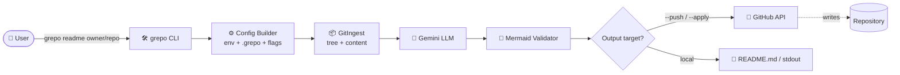

## Architecture

`grepo` is built on top of the [Effect](https://effect.website/) ecosystem, providing typed errors, composable services, and structured concurrency. The CLI is decomposed into **commands**, **services**, and **utilities**.

### Module Layout

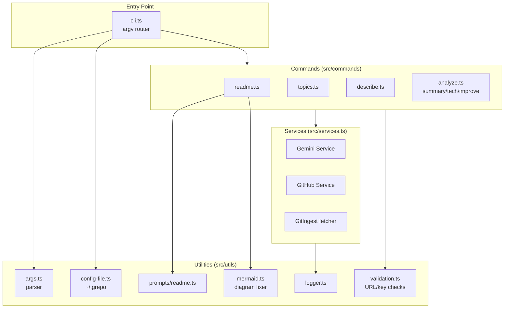

### Layered Architecture

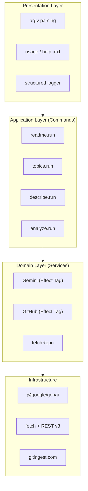

## Command Pipeline

Every command follows the same shape: **parse → fetch context → prompt → act**. The `readme` command adds analysis, generation, and mermaid validation phases.

### Generic Command Flow

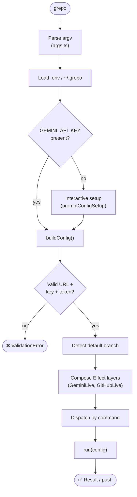

### `readme` — Three-Phase Generation

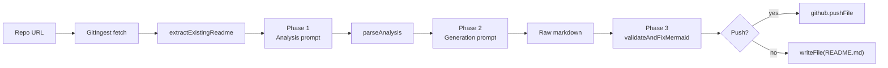

### `topics` — Suggest & Apply

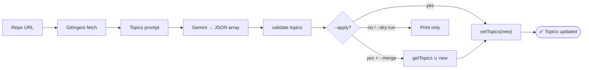

### `describe` — Description + Homepage Detection

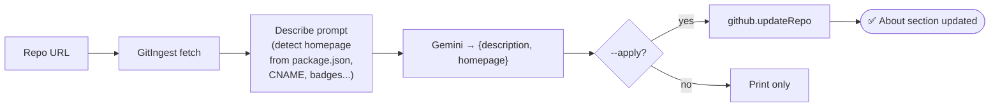

## Service Topology

Services are exposed as `Effect` Context Tags so commands can declare dependencies in their type signature without coupling to concrete clients.

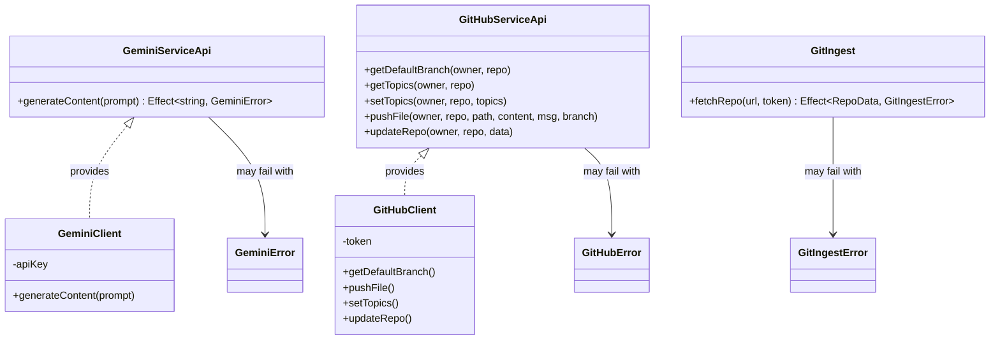

## Sequence: Generating a README

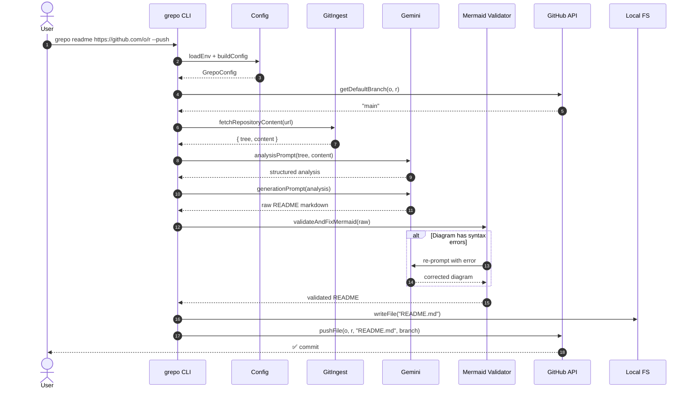

## Configuration Resolution

`grepo` resolves credentials in a layered, override-friendly order:

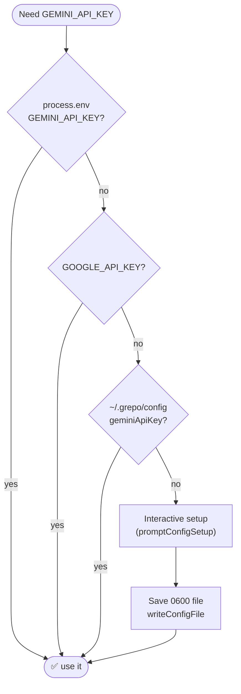

## Error Model

Errors are tagged data classes from `errors.ts`. Each command declares its possible failures in the type so `Effect.catchTags` can route them to user-friendly messages.

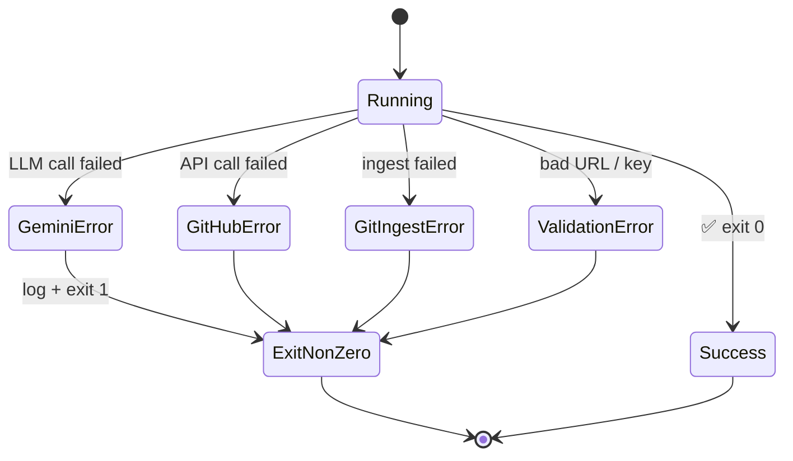

## Installation

Ensure you have [Bun](https://bun.sh/) (or Node ≥ 20.19) installed, then install `grepo` globally:

```bash
bun add -g @elysiumoss/grepo
# or
npm install -g @elysiumoss/grepo
```

## Usage

Generate a new `README.md` for a repository:

```bash
grepo readme https://github.com/owner/repo --format md --push
```

Automatically update repository topics based on code analysis:

```bash
grepo topics https://github.com/owner/repo --apply --merge
```

Generate a description and detect the homepage:

```bash
grepo describe https://github.com/owner/repo --apply
```

## CLI Reference

| Command    | Description                                                |
| :--------- | :--------------------------------------------------------- |
| `readme`   | Generate and optionally push a README documentation file   |
| `topics`   | Analyze code and suggest/apply repository topics           |
| `describe` | Generate a repository description and detect homepage URLs |
| `summary`  | Provide a comprehensive summary of the repository          |
| `tech`     | List technologies, frameworks, and tools used              |
| `improve`  | Suggest 5 specific, actionable improvements                |

### Options

| Flag                  | Applies to              | Description                                                |
| :-------------------- | :---------------------- | :--------------------------------------------------------- |
| `--format md\|mdx`    | `readme`                | Output format (default: `md`)                              |
| `--style …`           | `readme`                | `minimal`, `standard`, or `comprehensive` (default: standard) |
| `--output <file>`     | `readme`                | Output file path                                           |
| `--push`              | `readme`                | Commit the generated file directly to GitHub               |
| `--apply`             | `topics`, `describe`    | Apply changes to the GitHub API                            |
| `--merge`             | `topics`                | Merge with existing topics instead of replacing            |
| `--dry-run`           | all mutating commands   | Preview changes without writing or pushing                 |
| `--branch <name>`     | `readme`                | Target branch (default: auto-detect from repo)             |
| `--tone <voice>`      | `readme`                | `casual`, `professional`, `minimal`, or `technical`        |

## Configuration

`grepo` requires authentication for repository access and AI analysis. Configure these via environment variables, a `.env` file, or `~/.grepo/config.json`:

| Key                                 | Required for                       |
| :---------------------------------- | :--------------------------------- |
| `GEMINI_API_KEY` / `GOOGLE_API_KEY` | All commands (LLM analysis)        |
| `GH_TOKEN` / `GITHUB_TOKEN`         | `--push`, `--apply`, `--merge`     |

**Example `.env` file:**

```env
GEMINI_API_KEY=AIzaSy...
GH_TOKEN=ghp_...
```

If no key is present, `grepo` will run an interactive setup on first use and persist your choices to `~/.grepo/config.json` with `0600` permissions.

## Development

```bash
git clone https://github.com/ElysiumOSS/grepo
cd grepo
bun install
bun run build       # tsdown build
bun run test        # vitest
bun run lint        # biome check
```

### Testing Topology

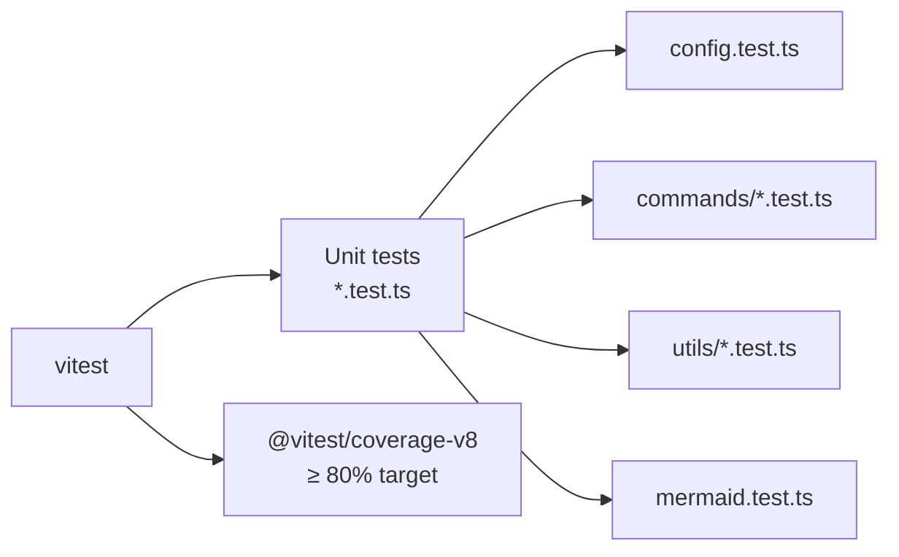

See [`.github/CONTRIBUTING.md`](./.github/CONTRIBUTING.md) and [`.github/DEVELOPMENT.md`](./.github/DEVELOPMENT.md) for detailed guidelines.

## License

This project is licensed under the [MIT License](LICENSE.md).
