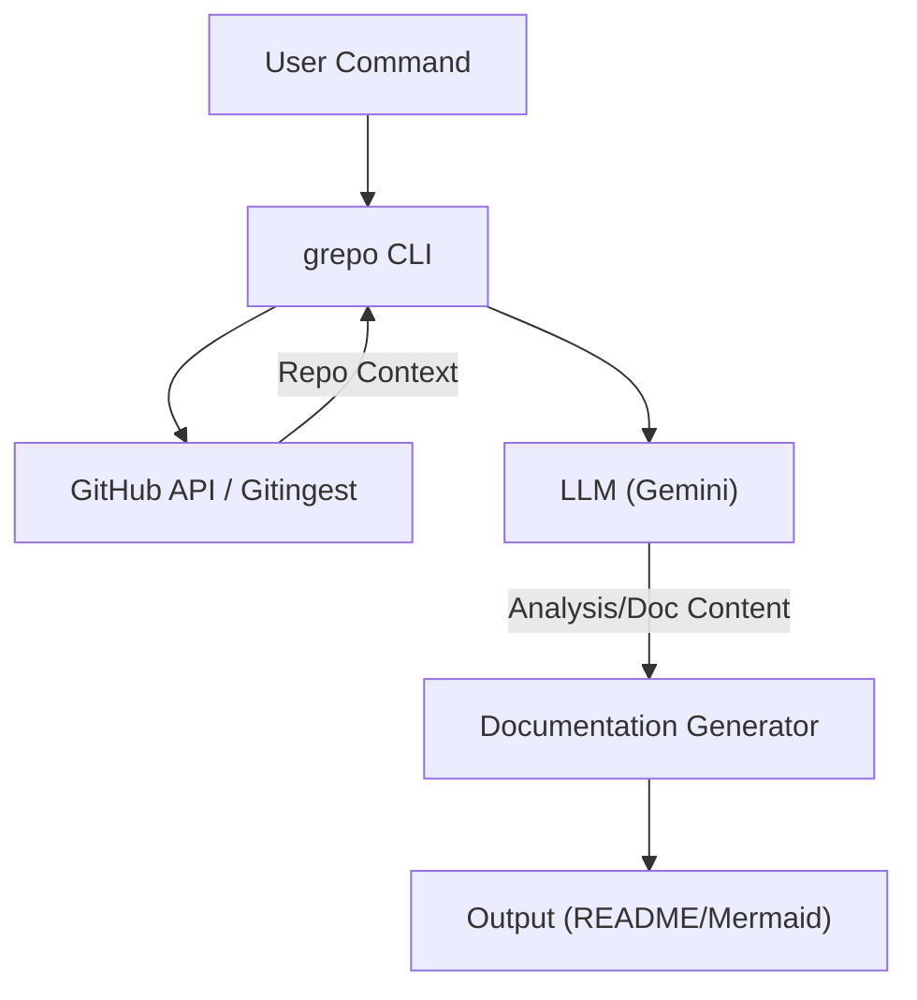

# grepo

<p align="center">
  <b>An agentic CLI tool for analyzing, describing, and generating documentation for GitHub repositories.</b>
</p>

<p align="center">
  <a href="https://github.com/ElysiumOSS/grepo/blob/main/LICENSE.md" target="_blank"></a>
  <a href="https://npmjs.com/package/@elysiumoss/grepo" target="_blank"></a>
</p>

## Overview

`grepo` automates the heavy lifting of repository maintenance. By integrating with LLM providers like Google Gemini, it intelligently analyzes your codebase to generate professional READMEs, suggest relevant repository topics, and craft repository descriptions.



## Installation

Ensure you have [Bun](https://bun.sh/) installed, then install `grepo` globally:

```bash
bun add -g @elysiumoss/grepo
```

## Usage

Generate a new `README.md` for a repository:

```bash
grepo readme https://github.com/owner/repo --format md --push
```

Automatically update repository topics based on code analysis:

```bash
grepo topics https://github.com/owner/repo --apply --merge
```

## CLI Reference

| Command | Description |
| :--- | :--- |
| `readme` | Generate and optionally push a README documentation file |
| `topics` | Analyze code and suggest/apply repository topics |
| `describe` | Generate a repository description and detect homepage URLs |
| `summary` | Provide a comprehensive summary of the repository |
| `tech` | List technologies, frameworks, and tools used |
| `improve` | Suggest 5 specific, actionable improvements |

**Options:**
- `--format md|mdx`: Output format (default: `md`)
- `--push`: Push the generated file directly to the GitHub repository
- `--apply`: Apply changes (topics/description) directly to the GitHub API
- `--dry-run`: Preview changes without writing or pushing
- `--model <id>`: Manually specify the LLM model to use

## Configuration

`grepo` requires authentication for repository access and AI analysis. Configure these via environment variables or a `.env` file:

- `GEMINI_API_KEY`: Required for AI code analysis.
- `GH_TOKEN` or `GITHUB_TOKEN`: Required for pushing files, updating topics, or repository descriptions.

**Example `.env` file:**
```env
GEMINI_API_KEY=AIzaSy...
GH_TOKEN=ghp_...
```

## Development

1. **Clone the repo:**
   ```bash
   git clone https://github.com/ElysiumOSS/grepo
   cd grepo
   bun install
   ```
2. **Build the project:**
   ```bash
   bun run build
   ```
3. **Run tests:**
   ```bash
   bun run test
   ```

See [`.github/CONTRIBUTING.md`](./.github/CONTRIBUTING.md) and [`.github/DEVELOPMENT.md`](./.github/DEVELOPMENT.md) for detailed guidelines.

## License

This project is licensed under the [MIT License](LICENSE.md).